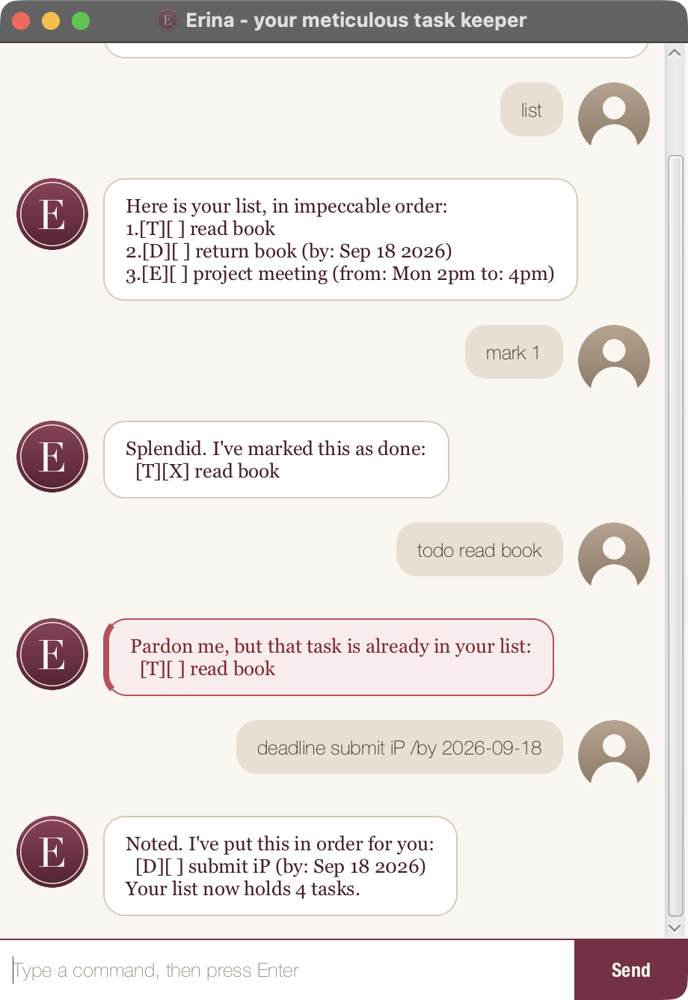

# Erina

Erina is a desktop chatbot that keeps your to-dos, deadlines and events in
impeccable order. You type short commands into a chat window, and Erina replies
in the conversation. Your tasks are saved automatically, so they are still there
the next time you open her.



## Getting started

1. Make sure **Java 25** is installed. Run `java -version` to check.
2. Download `erina.jar` from the [latest release](https://github.com/tommyquak/ip/releases/latest).
3. Put the file in an empty folder, open a terminal in that folder, and run:

   ```
   java -jar erina.jar
   ```

Erina's window opens and greets you. Type `help` to see every command.

The [user guide](https://tommyquak.github.io/ip/) explains each command in full,
with examples and the exact replies.

## Commands

| Command | What it does |
|---|---|
| `help` | Show every command |
| `todo <description>` | Add a task with no date |
| `deadline <description> /by <yyyy-mm-dd>` | Add a task due by a date |
| `event <description> /from <start> /to <end>` | Add a task with a start and an end |
| `list` | Show every task |
| `mark <task number>` | Mark a task as done |
| `unmark <task number>` | Mark a task as not done yet |
| `find <keyword>` | Show tasks whose description contains the keyword |
| `delete <task number>` | Remove a task |
| `bye` | Say goodbye and close the window |

Erina saves your tasks to `data/erina.txt`, next to the JAR, after every change.
If that file is damaged she keeps a copy as `data/erina.txt.bak` and starts you
on a fresh list.

## Building from source

Prerequisites: JDK 25, and a recent version of IntelliJ IDEA.

1. Open IntelliJ. If a project is already open, click `File` > `Close Project`
   first.
2. Click `Open`, select the project directory, and accept the defaults for any
   further prompts.
3. Configure the project to use **JDK 25**, not another version, as explained
   [here](https://www.jetbrains.com/help/idea/sdk.html#set-up-jdk). In the same
   dialog, set the **Project language level** field to the `SDK default` option.

Useful Gradle tasks:

| Task | What it does |
|---|---|
| `./gradlew run` | Run the GUI |
| `./gradlew shadowJar` | Build `build/libs/erina.jar` |
| `./gradlew test` | Run the JUnit tests |
| `./gradlew check` | Run the tests and Checkstyle |

There is also a text version, useful for quick checks, at
`src/main/java/erina/Erina.java`. Run it with
`java -cp build/libs/erina.jar erina.Erina`.

Keep `src/main/java` as the root folder for Java files. Renaming those folders,
or moving Java files outside that path, breaks Gradle and other tools that
expect the default layout.

## Acknowledgements

* The GUI is adapted from the
  [JavaFX tutorial](https://se-education.org/guides/tutorials/javaFx.html) by
  se-education.org.
* The project started from the
  [CS2103 iP template](https://github.com/NUS-CS2103-AY2627-S1/ip).
* AI assistance (Claude) was used for the week 6 increments. All output was
  reviewed and tested.
